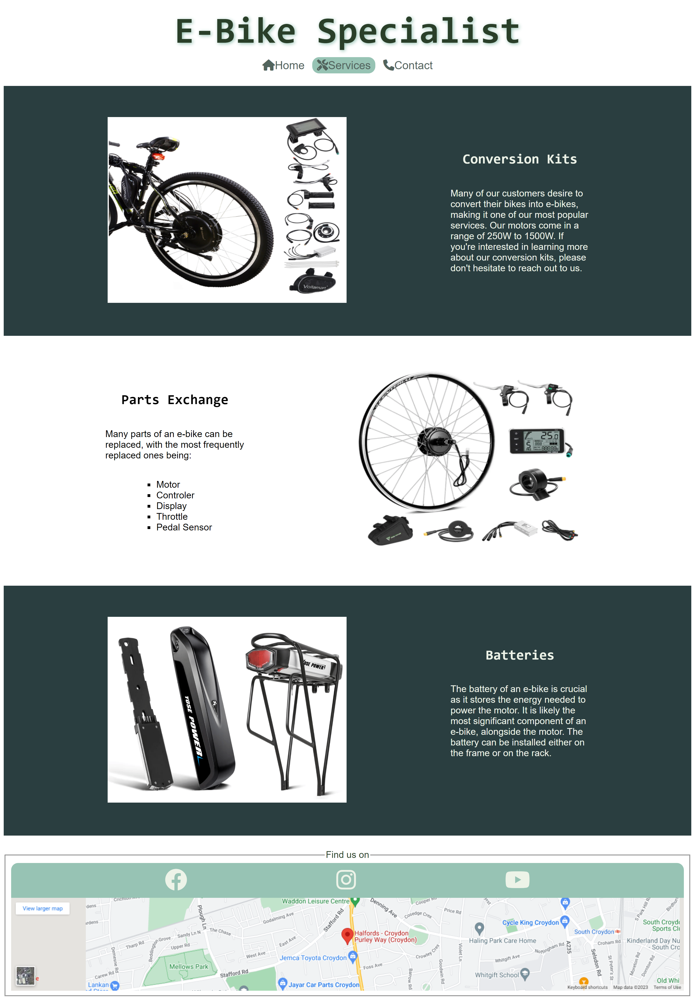
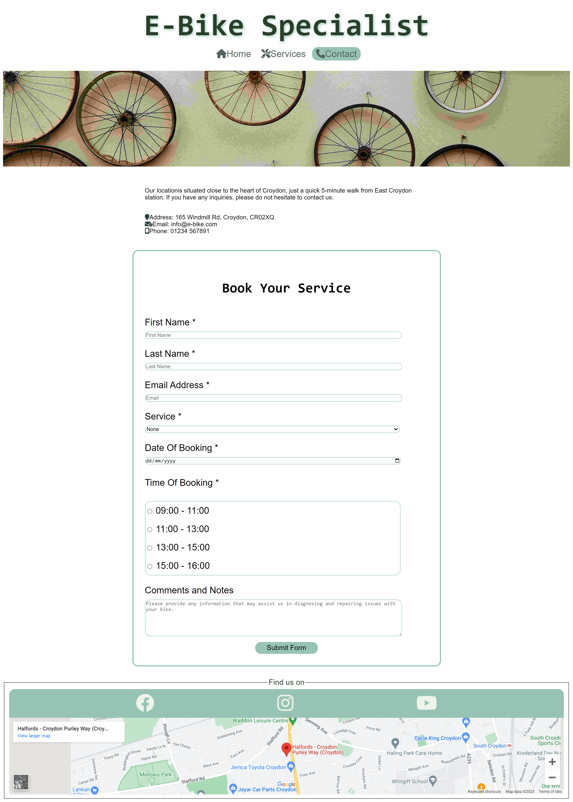
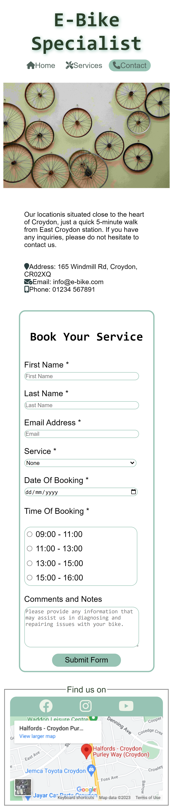

# E-Bike Specialist

E-Bike Specialist is a website that was created out of necessity. With the e-bike industry on the rise, there are few places that specialize in repairing them. Additionally, many shops that sell standard bikes are not equipped or willing to repair e-bikes. This website is aimed at e-bike users and food delivery drivers. Many riders are choosing e-bikes over motorcycles, and they need to know that we can fix any issues they may encounter.
 

[Live Website] (<https://terintealexandrin18.github.io/p1ebike/>)
 
[Github Repository] (<https://github.com/terintealexandrin18/p1ebike>)

## Table of Contents

1. [User Experience](#user-experience)
   1. [Project Goal](#project-goal)
   2. [User Stories](#user-stories)
   3. [Color Scheme](#color-scheme)
   4. [Typography](#typography)
2. [Features](#features)
   1. [Header](#header)
   2. [Navigation](#navigation)
   3. [Landing Page](#landing-page)
   4. [Footer](#footer)
   5. [Services Page](#services-page)
   6. [Contact Page](#contact-page)
   7. [Future Features](#future-features)
3. [Technologies](#3-technologies)
   1. [Languages Used](#languages-used)
   2. [Frameworks, Libraries and Programs Used](#frameworks-libraries-and-programs-used)
4. [Testing](#4-testing)
   1. [Code Validation](#code-validation)
   2. [Accessibility](#accessibility)
   3. [Tools Testing](#tools-testing)
   4. [Manual Testing](#manual-testing)
5. [Finished Product](#5-finished-product)
6. [Deployment](#deployment)
7. [Credits](#7-credits)
   1. [Content](#content)
   2. [Media](#media)
   3. [Code](#code)
8. [Acknowledgements](#8-acknowledgements)

## 1 User experience

### Project Goal

- To create a website that provides users with suitable service offered
- To highlight the most popular services used by our customers
- To offer users the opportunity to get in touch with us and schedule an appointment.

### User Stories

#### - Home

- As a customer, I want to easily navigate the website.
- As a customer, I want a website that is both straightforward and informative.

#### - Service

- As a customer, I would appreciate having access to information regarding the frequently provided services.
- As a customer, I would like to view pictures of the parts that are being sold.

#### - Contact

- As a customer, I want to conveniently schedule an appointment.
- As a customer, I want to locate the business effortlessly.
- As a customer, I want to easily locate the business contact details.

### Color Scheme

- The color used is a slightly different shade of green, as it closely resembles the dark color of the bikes.

### Typography

- The font utilized on the webpage for body elements is **'Mukta', Sans-serif**, while headers use **'Roboto Mono', monospace**. For the navigation bar, legend, and submit button, **'REM', Sans-serif** is used.

## 2 Features

### Header

- The header displays the name and type of the business.
- The header serves as a navigation link too. Clicking on it will redirect you to the home page.
- The value of the header is to help the user easily identify the business type and quickly navigate back to the homepage when necessary.

### Navigation

- The navigation bar displays the current active page with a green background.
  - The value of the feature is to assist the user in identifying the current page they are navigating.
- The navigation bar will increase in size when the mouse is placed above it (only for large screens).
  - The value of the feature is to enhance our ability to navigate through the available pages.
- On smaller screens, the font size of the navigation bar is reduced.
  - The value of this feature is to adjust the navigation for smaller screens without affecting the page's interface.
- The value of the navigation bar is to enable customers to easily navigate through the website without having to go back to previous pages.

### Landing Page

#### - Main Image Section

- The primary image on the website is intended to inform customers about the nature of our business, our mission, and our company motto.
  - The value of the image is to capture the user's attention and encourage them to stay on the page.

#### - About us Section

- The section contain information about the business and its specialties.
  - The value of that is to introduce the business to the customer.
- The section contains details about the offer currently available for delivery drivers.
  - The value of that is to attract the majority of customers.
- The section displays the operating hours.
  - The value of the feature is for the customer to know the operating hours.
- The section displays the image and text horizontally on larger screens, and vertically on smaller screens.
  - The value of the future is the content remains visible and readable without requiring users to zoom in or scroll horizontally.
  
  

### Footer

- Footer contains links to our social media platforms.
  - The value of the feature is designed to help customers stay connected, engaged, and updated with our business.
- Footer contain the location on Google Maps, allowing the customers to easily find our location.
  - The value of this feature is to offer precise information to customers, enabling them to easily find the business.

### Services Page

- This section showcases the most commonly used services.
  - The value of this feature is to improve the user experience and increase the chances of engagement and conversion.
- This section contains photos showcasing the services we provide for our customers.
  - The value of the feature is for understanding and clarifying the services, without needing to read all the descriptions.
- The photos will increase in size when the mouse is placed above it (only for large screen).
  - The value of the features is the ability to provide an interactive experience that captures users attention and ultimately enhances the overall user experience.
- The section displays the image and text horizontally on larger screens, and vertically on smaller screens.
  - The value of the future is the content remains visible and readable without requiring users to zoom in or scroll horizontally.
  
  

### Contact Page

- In this section, our email address and contact number are provided for easy access to customers who wish to contact us.
  - The value of this feature is to allow customers to easily contact the business, improving accessibility, trust, customer support, and communication.
- Our customers can conveniently schedule appointments through the website using the booking form.
  - This feature allows customers to schedule appointments through the website using the booking form. It offers the convenience of choosing a desired time slot and aims to provide customer satisfaction.

### Future Features
  
- In the near future, we plan to create a gallery page showcasing the services we have provided.
  - The value of this feature is to showcase the services we have provided to our customers. This can greatly influence the user's choice to utilize our services.

## 3 Technologies

### Languages Used

- [HTML5](https://en.wikipedia.org/wiki/HTML5) - For adding content and formatting to webpage.
- [CSS](https://en.wikipedia.org/wiki/CSS) - For adding style and color to webpage.

### Frameworks, Libraries and Programs Used

- [Google Fonts](https://fonts.google.com) - Used to import the fonts used in the entire website.

- [Font Awesome](https://fontawesome.com) - Used to import the icon to enhance the visual experience.

- [Freepik](https://www.freepik.com) - Used to import the favicon for the website title.
  
- [Pixabay](https://pixabay.com) - Used to import the image of the delivery driver.
  
- [Pexels](https://www.pexels.com) - Used to import the images for the main page and contact page.

- [Voilmart](https://www.voilamart.co.uk) - Used to import the first image for service page.

- [Yose Power](https://www.yosepower.co.uk) - Used to import the second and last image for service page.

- [ResizePixel](https://www.resizepixel.com) - Used to reduce the file size of the images for the entire website.
  
- [Codeanywhere](https://codeanywhere.com) - Used for writing the code, committing and push it to GitHub.

- [GitHub](https://github.com) - Used to store the project after finishing writing in Codeanywhere.

- [Am I Responsive?](https://ui.dev/amiresponsive) - Used to ensure that the design remained responsive throughout the process and to create mock-up images for use.

- [Chrome DevTools](https://developer.chrome.com/docs/devtools) - Used to review the code, test its responsiveness, and make any necessary adjustments in real time.

- [W3C Markup Validator](https://validator.w3.org) - Used to validate the HTML code.

- [W3C CSS Validator](https://jigsaw.w3.org/css-validator) - Used to validate the CSS code.

## 4 Testing

### Code Validation

- Used W3C Markup Validator and W3C CSS Validator services to ensure that there were no errors.
  - W3C Markup Validator found:
    - A duplicate ID, which was promptly transformed into a Class to fix the issue.
    - A section without a header, so a hidden header was added to rectify the issue.
    - An issue with the dropdown service, which was resolved by adding an additional option labelled "none" with no value.
    - Trailing slash on void elements; automatically added by Codeinstitute template. Fixed by contacting Codeinstitute and changed the "settings.json file"
- W3C CSS Validator found no issues on the final website.
  
#### - HTML Validation

 | Page     | Pass/Fail|  Results                                                                  |
 |--------- |----------| -----------------------------------------------------------------------------------|
 | Index    |      ✓   |   |
 | Services |      ✓   | |
 | Contact  |      ✓   |  |

#### - CSS Validation

| Page     | Pass/Fail|  Results                                                                  |
 |--------- |----------| -----------------------------------------------------------------------------------|
 | CSS    |      ✓   |   |

### Accessibility

- Utilised Lighthouse in Chrome DevTools.

| Page     |   Results                                                                  |
 |--------- | -----------------------------------------------------------------------------------|
 | Index    |   |
 | Services |  |
 | Contact  |   |

### Tools Testing

- [Chrome DevTools](https://developer.chrome.com/docs/devtools)
  - Used to review the code, test its responsiveness, and make any necessary adjustments in real time.
  
- Responsiveness
  - [Am I Responsive?](https://ui.dev/amiresponsive) - Used to ensure that the design remained responsive throughout the process and to create mock-up images for use.
  - [Chrome DevTools](https://developer.chrome.com/docs/devtools) - Utilized for testing the responsiveness of the devices accessible through DevTools.

### Manual Testing

- Browser Compatibility. The website has been tested on the following browsers:
  - Google Chrome - No issues found,
  - Microsoft Edge - No issues found.
  - Safari - No issues found.

- Device Compatibility. The website has been tested on the following devices:
  - IPhone 8 Plus - Encountered an issue with the form as its length exceeded the form border. To fix it had to adjust its size to 90% width.
  - IPhone 13 Pro Max - No issues found.
  - Samsung Galaxy Tab A7 - No issues found.
  - Samsung Galaxy S10 Plus - No issues found.
  - Samsung Galaxy S22 Ultra 5G - No issues found.
  - Microsoft Surface Pro X - No issues found.

- Elements testing on the page:

(Everything has been tested, and can confirm that all of them are functioning correctly and responding appropriately)

- Header

  - Checked when clicking on the header will take you to the main page.
  
- Navigation Bar
  
  - Checked the navigation bar displays the current active page with a green background.
  - Checked the navigation bar will increase in size when the mouse is placed above it (only for large screens).
  - Checked on smaller screens, the font size of the navigation bar is reduced.
  
- Footer

  - Checked the maps is fully responsive on different size of the screen.
  - Checked the zoom of the maps by clicking on plus and minus buttons.
  - Checked the social media links will open in a new tab.

- Index Page
  
  - Checked the page is fully responsive on small screens and large screens.
  - Checked on the small screen the body elements are aligned vertically.
  - Checked when clicking on the "contact page" link button will redirect to Contact Page.
  
- Services Page

  - Checked the photos will increase  in size when the mouse is placed above it.
  - Checked the section displays the image and text horizontally on larger screens, and vertically in smaller screens.

- Contact Page

  - Checked one by one that all fields from the form need to be filed in before submitted; apart from Comments and Notes.

## 5. Finished Product

Page | Desktop version | Mobile version
--- | --- | ---
Index |  | 
Services |  | 
Contact |  | 

## 6. Deployment

- This website was created using Codeanywhere and then used the git push command to commit and push it to GitHub.

- GitHub pages. The steps are
  1. Log into GitHub.
  2. Navigate to your repositories and select the project you want to deploy.
  3. Click on "Settings" located on the right-hand side and scroll down until you find the "Pages".
  4. Under "Source," click on the dropdown and choose "main" branch. Then, click on the "Save" button.
  5. The page will reload, and you will see a link to your published page displayed under "GitHub Pages."
  6. The site will be published in a few minutes.
  7. Congratulations, you have successfully deployed your project!

## 7. Credits

### Content

- The whole content was written by the developer

### Media

- [Yose Power](https://www.yosepower.co.uk) - Used for second and last image for service page.
- [Voilmart](https://www.voilamart.co.uk) - Used for first image for service page.
- [Pixabay](https://pixabay.com) - Used the image of the delivery driver for index page.
- [Pexels](https://www.pexels.com) - Used the images for the main page and contact page.

### Code

- [W3Schools](https://www.w3schools.com) - Used to assist with the necessary codes or for clearer comprehension.

## 8. Acknowledgements

- My wife for checking the website and providing with valuable feedback.

- Marcel, my tutor for guidance and feedback.
  
- Code institute team for support.
