# E-Bike Specialist

E-Bike Specialist is a website that was created out of necessity. With the e-bike industry on the rise, there are few places that specialize in repairing them. Additionally, many shops that sell standard bikes are not equipped or willing to repair e-bikes. This website is aimed at e-bike users and food delivery drivers. Many riders are choosing e-bikes over motorcycles, and they need to know that we can fix any issues they may encounter.
 

[Live Website] (<https://terintealexandrin18.github.io/p1ebike/>)
 
[Github Repository] (<https://github.com/terintealexandrin18/p1ebike>)

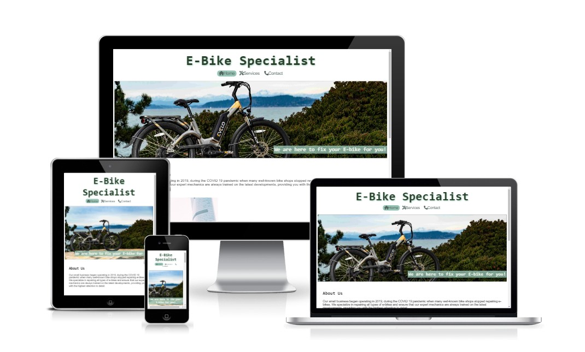

## Table of Contents

1. User Experience
   - Project Goal
   - User Stories
   - Color Scheme
   - Typography
2. Features
   - Header
   - Navigation
   - Landing Page
   - Footer
   - Services Page
   - Contact Page
   - Future Features
3. Technologies
   - Languages Used
   - Frameworks, Libraries and Programs Used
4. Testing
   - Code Validation
   - Accessibility
   - Tools Testing
   - Manual Testing

## 1 User experience

### Project Goal

- To create a website that provides users with suitable service offered
- To highlight the most popular services used by our customers
- To offer users the opportunity to get in touch with us and schedule an appointment.

### User Stories

#### Home

- As a customer, I want to easily navigate the website.
- As a customer, I want a website that is both straightforward and informative.

#### Service

- As a customer, I would appreciate having access to information regarding the frequently provided services.
- As a customer, I would like to view pictures of the parts that are being sold.

#### Contact

- As a customer, I want to conveniently schedule an appointment.
- As a customer, I want to locate the business effortlessly.
- As a customer, I want to easily locate the business contact details.

### Color Scheme

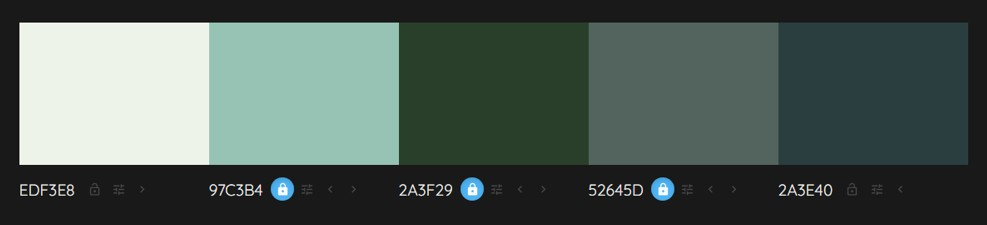

The color used is a slightly different shade of green, as it closely resembles the dark color of the bikes.

### Typography

The font utilized on the webpage for body elements is **'Mukta', Sans-serif**, while headers use **'Roboto Mono', monospace**. For the navigation bar, legend, and submit button, **'REM', Sans-serif** is used.

## 2 Features

### Header

- The header displays the name and type of the business.
- The header serves as a navigation link too. Clicking on it will redirect you to the home page.

### Navigation

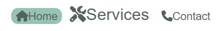

- The navigation bar displays the current active page with a green background (only for large screens).
- The navigation bar will increase in size when the mouse is placed above it.
- On smaller screens, the font size of the navigation bar is reduced.

### Landing Page

Main Image Section

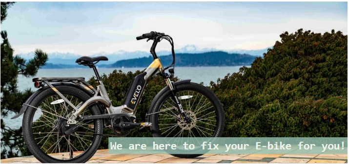

- The primary image on the website is intended to inform customers about the nature of our business, our mission, and our company motto.

About us Section

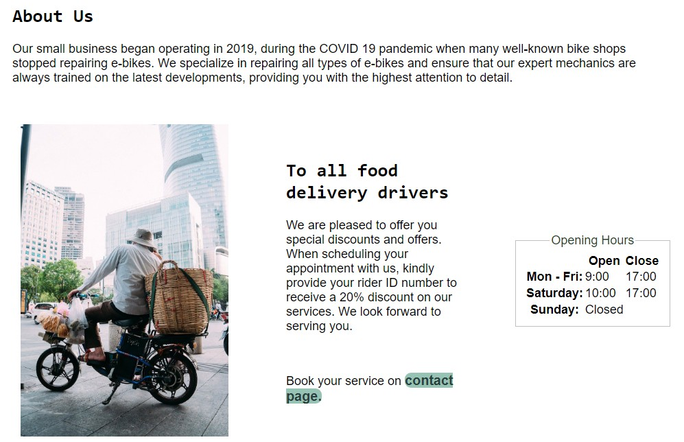

- The section contain information about the business and its specialties.
- The section contains details about the offer currently available for delivery drivers.
- The section displays the operating hours.
- The section displays the image and text horizontally on larger screens, and vertically on smaller screens.
  
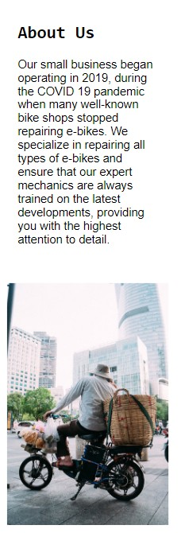  

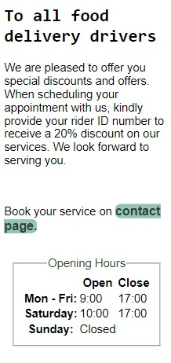

### Footer

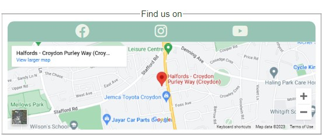

- Footer contains links to our social media platforms.
- Footer contain the location on Google Maps, allowing the customers to easily find our location.

### Services Page

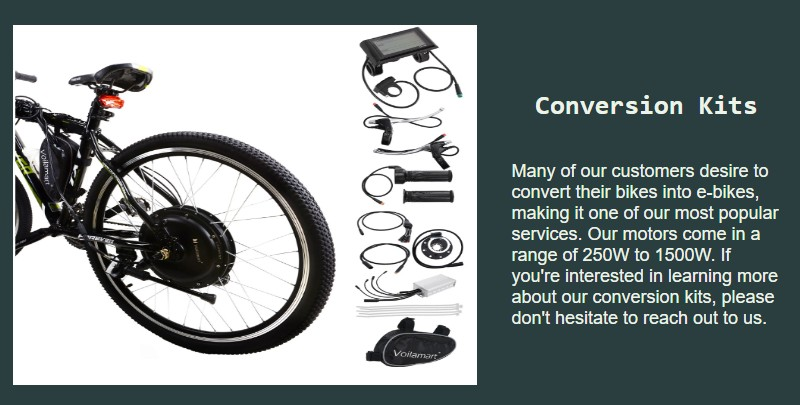

- This section showcases the most commonly used services.
- This section contains photos showcasing the services we provide for our customers.
- The photos will increase in size when the mouse is placed above it.
- The section displays the image and text horizontally on larger screens, and vertically on smaller screens.
  
  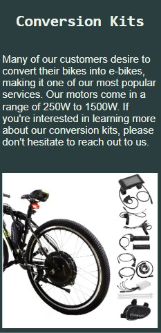

### Contact Page

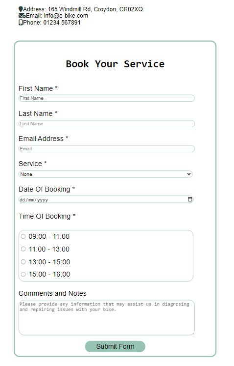

- In this section, our email address and contact number are provided for easy access to customers who wish to contact us.
- Our customers can conveniently schedule appointments through the website using the booking form.

### Future Features
  
- In the near future, we plan to create a gallery page showcasing the services we have provided.

## 3 Technologies

### Languages Used

- [HTML5](https://en.wikipedia.org/wiki/HTML5) - For adding content and formatting to webpage.
- [CSS](https://en.wikipedia.org/wiki/CSS) - For adding style and color to webpage.

### Frameworks, Libraries and Programs Used

- [Google Fonts](https://fonts.google.com) - Used to import the fonts used in the entire website.

- [Font Awesome](https://fontawesome.com) - Used to import the icon to enhance the visual experience.

- [Freepik](https://www.freepik.com) - Used to import the favicon for the website title.
  
- [Pixabay](https://pixabay.com) - Used to import the image of the delivery driver.
  
- [Pexels](https://www.pexels.com) - Used to import the images for the main page and contact page.

- [Voilmart](https://www.voilamart.co.uk) - Used to import the first image for service page.

- [Yose Power](https://www.yosepower.co.uk) - Used to import the second and last image for service page.

- [ResizePixel](https://www.resizepixel.com) - Used to reduce the file size of the images for the entire website.
  
- [Codeanywhere](https://codeanywhere.com) - Used for writing the code, committing and push it to GitHub.

- [GitHub](https://github.com) - Used to store the project after finishing writing in Codeanywhere.

- [Am I Responsive?](https://ui.dev/amiresponsive) - Used to ensure that the design remained responsive throughout the process and to create mockup images for use.

- [Chrome DevTools](https://developer.chrome.com/docs/devtools) - Used to review the code, test its responsiveness, and make any necessary adjustments in real time.

- [W3C Markup Validator](https://validator.w3.org) - Used to validate the HTML code.

- [W3C CSS Validator](https://jigsaw.w3.org/css-validator) - Used to validate the CSS code.

## 4 Testing

### Code Validation

- Used W3C Markup Validator and W3C CSS Validator services to ensure that there were no errors.
- W3C Markup Validator found: a duplicate ID, which was promptly transformed into a Class to fix the issue.
- W3C Markup Validator found: a section without a header, so a hidden header was added to rectify the issue.
- W3C Markup Validator found: an issue with the dropdown service, which was resolved by adding an additional option labeled "none" with no value.
- W3C Markup Validator found: trailing slash on void elements; automatically added by Codeinstitute template. Fixed by contacting Codeinstitute and changed the "settings.json file"
- W3C CSS Validator found no issues.
  
  HTML Validation

 | Page     | Pass/Fail|  Results                                                                  |
 |--------- |----------| -----------------------------------------------------------------------------------|
 | Index    |      ✓   |   |
 | Services |      ✓   | 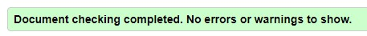|
 | Contact  |      ✓   |  |

 CSS Validation

| Page     | Pass/Fail|  Results                                                                  |
 |--------- |----------| -----------------------------------------------------------------------------------|
 | CSS    |      ✓   | 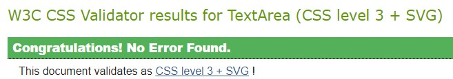  |
 

### Accessibility

- Utilised Lighthouse in Chrome DevTools.

| Page     |   Results                                                                  |
 |--------- | -----------------------------------------------------------------------------------|
 | Index    | 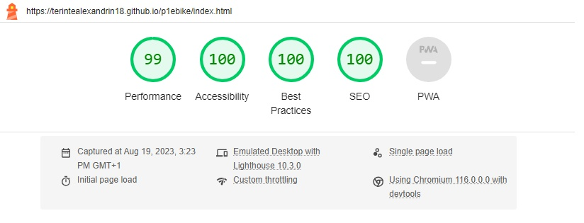  |
 | Services |  |
 | Contact  |  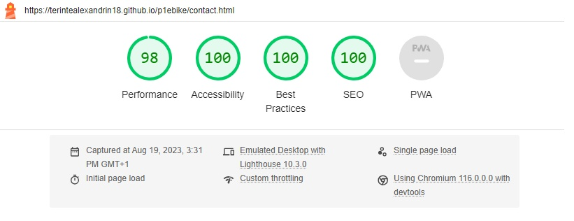 |

